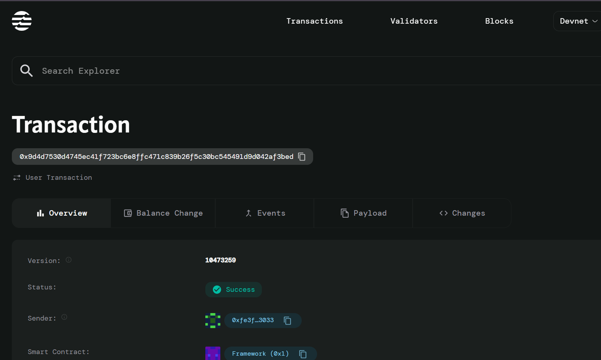

# NFT Royalty System

## Project Description
Create automatic royalty distribution on secondary sales - A smart contract system that ensures NFT creators receive a percentage of revenue from every secondary market transaction of their digital assets. This eliminates the need for manual royalty tracking and guarantees creators are compensated fairly for their work throughout the NFT's lifetime.

## Project Vision
To revolutionize the NFT ecosystem by creating a transparent, automated, and creator-friendly royalty distribution system that empowers digital artists and content creators. Our vision is to build a sustainable creative economy where creators can rely on continuous income from their work, fostering innovation and artistic expression in the blockchain space.

## Key Features

### 🎨 **Automated Royalty Distribution**
- Seamless automatic royalty payments to original creators on every secondary sale
- No manual intervention required - smart contract handles all transactions

### 💰 **Flexible Royalty Rates**
- Customizable royalty percentages set by creators during NFT minting
- Transparent fee structure visible to all marketplace participants

### 📊 **Comprehensive Tracking**
- Real-time tracking of total sales, royalty collections, and ownership history
- Complete transparency for creators to monitor their NFT performance

### 🔒 **Secure Ownership Management**
- Immutable ownership records stored on-chain
- Automatic ownership transfer with each validated sale

### ⚡ **Gas Efficient Operations**
- Optimized smart contract design for minimal transaction costs
- Single transaction handles sale, royalty distribution, and ownership transfer

### 🌐 **Marketplace Agnostic**
- Compatible with any NFT marketplace that integrates with Aptos blockchain
- Standardized interface for easy adoption across platforms

## Future Scope

### Phase 1: Enhanced Features
- **Multi-Creator Royalties**: Support for splitting royalties among multiple creators
- **Dynamic Royalty Rates**: Time-based or volume-based royalty adjustments
- **Royalty Caps**: Maximum lifetime royalty limits for specific use cases

### Phase 2: Advanced Analytics
- **Creator Dashboard**: Comprehensive analytics and revenue tracking interface
- **Market Intelligence**: Price trends and performance metrics for creators
- **Automated Reporting**: Regular royalty reports and tax documentation

### Phase 3: Cross-Chain Integration
- **Multi-Chain Support**: Extend royalty system to other blockchain networks
- **Bridge Compatibility**: Seamless royalty tracking across different chains
- **Universal Standards**: Contribute to industry-wide royalty standards

### Phase 4: Ecosystem Expansion
- **Creator Tools Integration**: APIs for art platforms and creation tools
- **Marketplace Partnerships**: Deep integration with major NFT marketplaces
- **DeFi Integration**: Royalty staking and yield farming opportunities

## Contract Details
0x9d4d7530d4745ec41f723bc6e8ffc471c839b26f5c30bc545491d9d042af3bed
